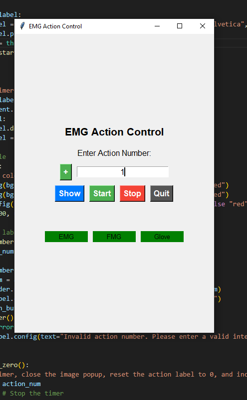

# Sensor Setup and Troubleshooting Guide  

## 📡 Connecting EMG Sensors with the Trigno Control Utility App  

### ✅ Sensor Setup  

To set up the **sensors** and the **Delsys SDK station**, follow these steps:  

#### **1️⃣ Connecting the Base Station**  
- Plug the **base station** into the computer and **charge it**.  
- Insert **all sensors** into the **base station slots** to initialize their status and activate them.  

#### **2️⃣ Pairing Sensors in Trigno TCU**  
- Open **Trigno TCU software**.  
- Click the **pairing button** for each sensor (**only one sensor at a time**).  
- Ensure the **sensor number in the software matches the program number**.  
- The software will display **“Waiting for sensor connection”**.  
- Remove the sensor from the slot and place it **under the lock symbol** below the base station antenna.  
- Tap the sensor **twice gently**:  
  - ✅ **Green blinking light** → Connection successful.  
  - ❌ **No connection** → Tap the sensor a few more times.  

### 🔹 **Additional Sensor Configuration**  
- The **Quattro sensor** must be assigned to **Sensor Position 1**.  
- The system reads **all sensors**, including those **not connected**, which may result in some columns in the data files containing `0.0`.  
- A sensor **must be connected to Position 3**, otherwise, the system will return an error.  
- If using a **Quattro sensor**, connect it to **Position 1**, ensuring that positions **1, 5, 9, and 13** are occupied.  
- Properly configure the Quattro sensor to **"EMG & IMU"** und the **settings** in the Trigno controll app.  

### 🔧 Debugging & Error Handling  
- If a **sensor has no signal bars**, reconnect it—this should resolve the issue.  
- If the **Python script cannot detect any sensors**, verify the **IP address** in `config.yaml` and ensure it matches the PC’s current IP.  
- If sensors are still not detected:  
  - Check in the **Trigno Control App** to confirm they are connected.  
  - **Unplug the system**, then restart it (**the app does not allow two masters at the same time**).  
- If the **eEMG flag turns red** during measurement:  
  - Save the session, **stop the measurement, and restart**.  
  - If necessary, **merge the data files afterward**.  
- If the issue persists, **unplug the device from the PC and reconnect it**.  

---

## 🎛️ FMG Armband Setup  

### ✅ Setup Steps  
- After connecting the **sEMG sensors**, integrate them into the **FMG armband**, ensuring the **correct sensor, lid, and plate orientation**.  
- Since the current program requires a **Wi-Fi network** for the **NPT server**, ensure **Wi-Fi is activated**.  
- Update the Arduino code to reflect the **correct Wi-Fi network credentials** (**Folder:** `armband_fmg`).  

### 🔧 Debugging & Error Handling  
- If the **FMG flag turns red** at the start of the measurement, restart the system (**the COM port may not have opened correctly**).  
- If the issue persists:  
  - Check if the **COM port is correct**.  
  - **Unplug and reconnect** the USB connection.  
  - **Restart the Wi-Fi connection**.  
  - Try again.  

---

## 🧤 CyberGlove  

The **CyberGlove** should function **immediately after connection** without any additional steps.  

### 🔧 Debugging & Error Handling  
- If the **Glove Flag turns red**:  
  - Toggle the **switch on the back of the CyberGlove box** off and then back on.  
  - Wait **about a minute** before retrying. This should resolve the issue.  

---

## How to Wear the Armband

The instructions for wearing the armband can be found in the **Protokoll** folder as a **.docs** file:

## 🖥️ Program Structure  

- `action.py` → **Main script**: Starts the measurement process and launches all other programs as **threads**.  
- `record_emg3.py` → Manages the **Trigno sensors (EMG & IMU)** and connects to the **Delsys SDK system**.  
- `record_fmg.py` → Establishes a **serial connection** to the microcontroller and writes **live data** into a **CSV file**.  
- `record_cyberglove.py` → Connects to the **CyberGlove** and records the sensor data.  

📊 **All other scripts** in this directory either **support these core functions** or are used **separately for data visualization**, such as **live plotting for FMG, CyberGlove, and EMG data**.  

## 🎬 Using `action.py` for Data Acquisition

### 1. **Starting `action.py`**

- When **`action.py`** is started, the program will prompt you to enter:
  - A **participant number**.
  - A **repetition number**.
- After entering the required information, the **GUI** for data acquisition will appear:

  

### 2. **Selecting the Desired Action**

- After the GUI appears, you will be prompted to **enter the action number** (starting from **1**).
- Click **Start** to initiate the process.
- The **action number** will be set to **1**, and you can proceed with executing the tasks.

### 3. **Executing the Tasks**

- Once you have completed a task, click on **Stop**.
- The **action number** will be reset to **0**, and the **task number** in the text field will be increased by one.
- The GUI will display the **next task image**.

### 4. **Quitting the Program**

- If you click **Quit**, the program will close, and **all data will be saved**.

